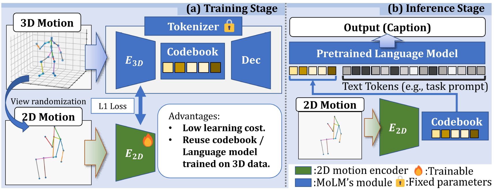
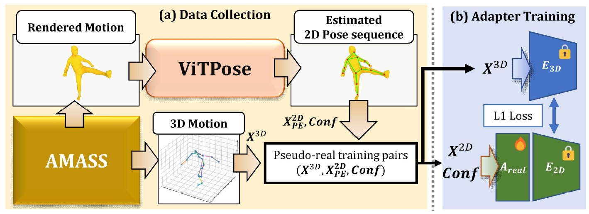

<div align="center">

# 🕺 A Plug-and-Play 2D Motion Interface<br>for Real-World Motion Language Models

<!-- TODO: replace with the real author list and affiliations -->
**Kaname Yokoyama**<sup>1</sup> · **Norimichi Ukita**<sup>1</sup><br>
<sup>1</sup> Toyota Technological Institute

<!-- TODO: swap the two "coming soon" badges for the real arXiv / project-page links -->
[](#)
[](#)
[](https://drive.google.com/drive/folders/1joJyXx_AsaNBFv-jxLN8gSfXePDDX4zY)
[](https://drive.google.com/drive/folders/17wtEU7ABA3yIj6JixG905bK7u47fMk9w?usp=drive_link)


[](https://github.com/irajisamurai/2D-Motion-Interface/stargazers)

</div>

---

## 🎬 Demo

<div align="center">

<video src="https://github.com/irajisamurai/2D-Motion-Interface/raw/main/Assets/demo_1.mp4" width="100%" controls muted loop playsinline>
  <a href="Assets/demo_1.mp4">▶ Watch the demo — Assets/demo_1.mp4</a>
</video>

<sub>A monocular real video with the estimated <b>ViTPose 2D keypoints</b> overlaid. The caption underneath is generated by our 2D Motion Interface — <b>no 3D pose estimation anywhere in the pipeline</b>.</sub>

</div>

## ✨ Highlights

- 🔌 **Plug-and-play, at very low training cost.** The interface is an external module: no modification and no fine-tuning of the pretrained MoLM. `E_2D` has **9.6M** parameters (~22 h) and the real-video adapter `A_real` only **0.3M** (~1 h), both on a single A100 40GB.
- 📈 **Comparable to 3D motion inputs.** On HumanML3D motion captioning, *Avg Drop vs 3D Input* is **−0.2%** (TM2T), **+0.4%** (MotionGPT), and **−2.8%** (MG-MotionLLM).
- 🥊 **Better than training MoLMs from scratch on 2D.** 2D Scratch drops **−25.8%** (TM2T) and **−12.8%** (MG-MotionLLM) versus 3D Input — our interface substantially reduces that gap at a fraction of the compute.
- 🔬 **2D and 3D motions align in both latent and token space.** Discrete token agreement with 3D-derived tokens reaches **44.8% / 59.6% / 67.1%** (Top-1/2/3), against a **0.20%** random baseline for a codebook of size 512.
- 🎥 **On real monocular video, 2D beats estimated 3D.** *2D Input w/ `A_real`* outperforms all 3D Input settings on almost all metrics across all three MoLMs — while being far cheaper: ViTPose (Base) needs **17.2 GFLOPs/frame** versus **250.2** for WHAM.
- 🗂 **New monocular real-world video motion dataset.** 132 videos from 10 participants (14,878 frames / 743.9 s), paired with estimated 2D (ViTPose) and 3D (TRACE, WHAM) motions and HumanML3D captions; 86.4% of video–caption pairs were human-verified as semantically consistent. [Publicly released](https://drive.google.com/drive/folders/1joJyXx_AsaNBFv-jxLN8gSfXePDDX4zY).


<details>
<summary><b>📑 Table of Contents</b></summary>

- [🎬 Demo](#-demo)
- [🔍 How It Works](#-how-it-works)
- [📊 Headline Results](#-headline-results)
- [📁 Repository Layout](#-repository-layout)
- [📦 Installation](#-installation)
- [📂 Dataset Preparation](#-dataset-preparation)
- [🧠 Pre-trained Checkpoints](#-pre-trained-checkpoints)
- [⚡ Quick Start](#-quick-start)
- [📈 Reproducing Key Results](#-reproducing-key-results)
- [🎯 Training](#-training)
- [🚧 Limitations](#-limitations)
- [📖 Citation](#-citation)
- [🙏 Acknowledgements](#-acknowledgements)

</details>

## 🔍 How It Works

<div align="center">
  
</div>

A new **2D motion encoder** `E_2D` is trained to map 2D motion into the same latent space as the MoLM's own 3D encoder, with a simple L1 loss on the latents. The codebook, decoder, and language model stay frozen and are reused as-is, so 2D motion is tokenized by the original codebook and captioned by the pretrained language model — with no 3D pose estimation in the loop.

### 🎥 On real video: the adapter

<div align="center">
  
</div>

`E_2D` is trained on clean 2D projections of mocap, while real video adds perspective distortion and pose-estimation noise. A small **real-video adapter** `A_real` (0.3M params) inserted before `E_2D` absorbs that gap. Since real videos have no ground-truth 3D, it is trained on **pseudo-real pairs**: AMASS motions rendered from random viewpoints, run through ViTPose, and paired with their own 3D.

## 📊 Headline Results

Both tables report **Avg Drop**, the average percentage difference from the reference 3D setting across all metrics (higher is better, `–` is the reference row itself).

**1 · Motion captioning on HumanML3D** — *Avg Drop vs 3D Input*. Replacing 3D inputs with our 2D interface costs almost nothing, while training the MoLM from scratch on 2D costs a great deal.

| Base model | 2D Scratch | **Ours (2D Motion Interface)** |
|:--|:--:|:--:|
| TM2T | −25.8% | **−0.2%** |
| MotionGPT | *not reported* <sup>†</sup> | **+0.4%** |
| MG-MotionLLM | −12.8% | **−2.8%** |

<sub><sup>†</sup> The MotionGPT 2D-Scratch result is omitted because the official implementation could not be stably retrained; the same reproducibility issue is open in the official repository.</sub>

**2 · Motion captioning on monocular real videos** — *Avg Drop vs Ref 3D Input*. `A_real` is our real-video adapter; `A_3D` is the same adapter applied to WHAM's estimated 3D motion for a fair comparison.

| Base model | 3D (TRACE) | 3D (WHAM) | 2D | 3D (WHAM) w/ `A_3D` | **2D w/ `A_real`** |
|:--|:--:|:--:|:--:|:--:|:--:|
| TM2T | −37.7% | −35.9% | −18.5% | −10.8% | **+4.3%** |
| MotionGPT | −40.3% | −34.1% | −31.4% | −21.1% | **−18.5%** |
| MG-MotionLLM | −50.7% | −35.6% | −46.7% | −34.9% | **−17.5%** |

**2D Input w/ `A_real` outperforms all 3D Input settings on almost all metrics across all models** — and does so far more cheaply: excluding human detection, ViTPose (Base) requires **17.2 GFLOPs/frame** against **250.2** for WHAM.

> [!NOTE]
> **Ref 3D Input** is the original HumanML3D motion sampled when collecting each video. It is *not* the strict ground-truth 3D motion of what the participant actually performed, so it serves as a reference point rather than a hard upper bound.

Full per-metric tables are in [Reproducing Key Results](#-reproducing-key-results).

## 📁 Repository Layout

| Directory | Base Model | Tasks | Role in this work |
|:--|:--|:--|:--|
| [`2DMotionGPT/`](2DMotionGPT/) | MotionGPT | M2T | Trains the 2D encoder and both adapters — the source of the shared weights |
| [`2DTM2T/`](2DTM2T/) | TM2T | M2T | **Reuses** the 2D encoder and adapters above |
| [`2DMG-MotionLLM/`](2DMG-MotionLLM/) | MG-MotionLLM | M2T, M2DT | Trains its own 2D encoder and adapters independently |

<sub>M2T = motion-to-text · M2DT = motion-to-detailed-text</sub>

## 📦 Installation

Each sub-project uses its **own conda environment** — the PyTorch versions are mutually incompatible, so all three are needed to reproduce everything.

| Sub-project | Env name | Python | PyTorch | CUDA |
|:--|:--|:--:|:--:|:--:|
| `2DMotionGPT/` | `mgpt_2d` | 3.10 | 2.9.0 | 11.8 |
| `2DTM2T/` | `tm2t` | 3.7 | 1.13.1 | 10.1 |
| `2DMG-MotionLLM/` | `mg-motionllm` | 3.9 | 2.8.0 | 11.8 |

```bash
cd <sub-project>                      # 2DMotionGPT | 2DTM2T | 2DMG-MotionLLM
conda env create -f environment.yml
conda activate <env-name>             # mgpt_2d | tm2t | mg-motionllm
```

## 📂 Dataset Preparation

### HumanML3D (all three sub-projects)

Follow the [HumanML3D](https://github.com/EricGuo5513/HumanML3D) repository to download and prepare the dataset. Expected structure:

```
HumanML3D/
├── new_joint_vecs/
├── texts/
├── Mean.npy
├── Std.npy
├── train.txt
├── val.txt
├── test.txt
└── all.txt
```

### FineMotion (2DMG-MotionLLM only)

Needed for the Motion-to-Detailed-Text task. Download `BPMSD_auto.zip` and `BPMSD_human.zip` from the FineMotion repository and place them under `dataset/HumanML3D/finemotion_texts/`:

```
dataset/HumanML3D/
├── finemotion_texts/
│   ├── BPMSD_auto.zip
│   ├── BPMSD_auto.json
│   ├── BPMSD_human.zip
│   └── BPMSD_human.json
└── ...
```

### Monocular real-world video motion dataset (ours)

Motion clips were randomly sampled from the **HumanML3D test set** and shown to participants, who imitated them while being recorded with a single RGB camera (iPhone SE 2nd generation), varying the relative viewpoint between subject and camera. Each video is paired with estimated 2D motion (ViTPose), estimated 3D motion (TRACE and WHAM), and the original HumanML3D caption of the sampled clip. All performers participated with informed consent.

| | |
|:--|:--|
| Videos | 132, from 10 participants (male and female, 20s–50s) |
| Frames / duration | 14,878 frames · 743.9 s |
| Captions | original HumanML3D captions of the sampled clips |
| Human verification | 3 annotators; **86.4%** of video–caption pairs judged semantically consistent |

> 📥 **[Download the real-world dataset (Google Drive)](https://drive.google.com/drive/folders/1joJyXx_AsaNBFv-jxLN8gSfXePDDX4zY)**

Expected structure:

```
dataset/
├── HumanML3D/
└── real_world_dataset_ver2/
```

## 🧠 Pre-trained Checkpoints

### Base models and dependencies

GloVe embeddings, evaluators, and base checkpoints come from the original repositories:

```bash
# MotionGPT
cd 2DMotionGPT
bash prepare/prepare_t5.sh
bash prepare/download_t2m_evaluators.sh
bash prepare/download_pretrained_models.sh

# MG-MotionLLM
cd 2DMG-MotionLLM
bash prepare/prepare_t5.sh
bash prepare/download_glove.sh
bash prepare/download_vqvae.sh
```

For MG-MotionLLM, also download the baseline checkpoints and place them in `2DMG-MotionLLM/`:

- 🤗 [`wbz0505/m2t-ft-from-GSPretrained-base`](https://huggingface.co/wbz0505/m2t-ft-from-GSPretrained-base)
- 🤗 [`wbz0505/m2dt-ft-from-GSPretrained-base`](https://huggingface.co/wbz0505/m2dt-ft-from-GSPretrained-base)

### Our checkpoints

> 📥 **[Download our 2D encoders and adapters (Google Drive)](https://drive.google.com/drive/folders/17wtEU7ABA3yIj6JixG905bK7u47fMk9w?usp=drive_link)**

## ⚡ Quick Start

Once [Installation](#-installation), the [real-world dataset](#-dataset-preparation), and [our checkpoints](#-pre-trained-checkpoints) are in place, this single command reproduces the headline real-world result:

```bash
cd 2DMotionGPT
conda activate mgpt_2d
python evaluate_with_realworld.py \
    --cfg configs/config_h3d_stage1.yaml --nodebug \
    --estimated_motion_dir ./dataset/real_world_dataset_ver2/pred \
    --vqvae_ckpt ./checkpoints/2d_vqvae_ver3/MotionGPT_2DEncoder/encoder_only-l1-bs64-lr0.0001/best_vqvae_epoch2960_valacc0.4471.tar \
    --adapter_ckpt ./checkpoints/adapter/MotionGPT_2DEncoder/adapter-residual-bs64-lr1e-3/best_adapter_epoch690_valloss1.2251.tar \
    --adapter_type residual \
    --mode both
```

`--mode both` evaluates with and without the adapter in one pass, so you get the comparison directly.

## 📈 Reproducing Key Results

### 1. M2T Evaluation on HumanML3D (2D encoder vs 3D baseline)

**2DMotionGPT** — evaluate 2D encoder and 3D baseline side by side:
```bash
cd 2DMotionGPT
conda activate mgpt_2d
# 3D baseline
python evaluate_motionGPT.py --gpu_id 7 --eval_3d \
    --output results/eval_3d_bs1.json

# 2D encoder
python evaluate_motionGPT.py --gpu_id 7 \
    --vqvae_ckpt ./checkpoints/2d_vqvae_ver3/MotionGPT_2DEncoder/encoder_only-l1-bs64-lr0.0001/best_vqvae_epoch2960_valacc0.4471.tar \
    --output results/eval_2d_bs1.json
```

<details><summary>📊 Paper Results — Table 1, MotionGPT (HumanML3D test set)</summary>

| Method | R-Prec Top-1↑ | Top-2↑ | Top-3↑ | MM-Dist↓ | BLEU-1↑ | BLEU-4↑ | ROUGE-L↑ | CIDEr↑ | BERTScore↑ | Avg Drop vs 3D↑ |
|---|---|---|---|---|---|---|---|---|---|---|
| 3D Input | 0.516 | 0.707 | **0.803** | 2.994 | 0.429 | 0.062 | 0.345 | **0.079** | 0.316 | – |
| Ours | **0.523**<br><sub>±0.002</sub> | **0.717**<br><sub>±0.003</sub> | 0.802<br><sub>±0.003</sub> | **2.985**<br><sub>±0.015</sub> | **0.431**<br><sub>±0.000</sub> | **0.063**<br><sub>±0.001</sub> | **0.346**<br><sub>±0.001</sub> | 0.077<br><sub>±0.001</sub> | **0.319**<br><sub>±0.001</sub> | **+0.4%** |

`Ours` is the mean ± std over three runs. **2D Scratch is not reported for MotionGPT**: the official implementation could not be stably retrained, an issue also open in the official repository.

</details>

---

<!--**2DTM2T** — first tokenize, then evaluate:
```bash
cd 2DTM2T
# 3D baseline
python tokenize_script_motiongpt.py --gpu_id 0 --name MotionGPT-base --dataset_name t2m --motiongpt_ckpt <path/to/motiongpt_s3_h3d.tar>
python final_evaluations_m2t.py --tokenizer_name MotionGPT-base \
    --m2t_name M2T_MotionGPT_EL4_DL4_NH8_PS --gpu_id 0 --codebook_size 512
# 2D scratch (full VQ-VAE trained from scratch on 2D data)
python tokenize_script_motiongpt_2d_rec.py --gpu_id 0 --name MotionGPT_2DReconstruction \
    --dataset_name t2m --recon_ckpt <path/to/2d_scratch_encoder.tar>
python final_evaluations_m2t.py --tokenizer_name MotionGPT_2DReconstruction \
    --m2t_name M2T_MotionGPT_2DRecon_EL4_DL4_NH8_PS --gpu_id 0
# 2D encoder
python tokenize_script_motiongpt_2d.py --gpu_id 0 --name MotionGPT-base-2D \
    --dataset_name t2m --encoder_2d_ckpt <path/to/2d_encoder.tar>
python final_evaluations_m2t.py --tokenizer_name MotionGPT-base-2D \
    --m2t_name M2T_MotionGPT_EL4_DL4_NH8_PS --gpu_id 0
```

<details><summary>Paper Results — Table 1, TM2T (HumanML3D test set)</summary>

| Method | R-Prec Top-1↑ | Top-2↑ | Top-3↑ | MM-Dist↓ | BLEU-1↑ | BLEU-4↑ | ROUGE-L↑ | CIDEr↑ | BERTScore↑ | Avg Drop vs 3D↑ |
|---|---|---|---|---|---|---|---|---|---|---|
| 3D Input | **0.488** | **0.689** | 0.786 | 3.137 | 0.615 | **0.233** | 0.492 | **0.691** | 0.368 | – |
| 2D Scratch | 0.279 | 0.447 | 0.562 | 4.921 | 0.550 | 0.175 | 0.437 | 0.499 | 0.312 | −25.8% |
| Ours | 0.485 | 0.683 | **0.788** | **3.129** | **0.616** | 0.232 | 0.492 | 0.688 | 0.368 | **−0.2%** |

`Ours` is the mean over three runs (± ≤0.005 on every metric).

</details>

---
-->

**2DMG-MotionLLM** — evaluate 3D baseline and 2D encoder sequentially:
```bash
cd 2DMG-MotionLLM
# 3D baseline + 2D encoder (2D encoder is auto-detected from checkpoints/2d_vq_train/t2m/)
# M2T
python eval_m2t.py --model_name ./m2t-ft-from-GSPretrained-base
# M2DT
python eval_m2dt.py --model_name ./m2dt-ft-from-GSPretrained-base

# 2D scratch (full VQ-VAE trained from scratch on 2D data)
# M2T
python eval_m2t.py --model_name ./m2t-2drecon-100k/checkpoint-100000 \
    --vqvae_2drecon_ckpt ../2DMotionGPT/checkpoints/2d_vqvae_full/MotionGPT_2DEncoder/full_recon_2d-l1_smooth-bs64-lr0.0001/best_vqvae_epoch2990_valloss0.0354.tar
# M2DT
python eval_m2dt.py --model_name ./m2dt-2drecon/checkpoint-300000 \
    --vqvae_2drecon_ckpt ../2DMotionGPT/checkpoints/2d_vqvae_full/MotionGPT_2DEncoder/full_recon_2d-l1_smooth-bs64-lr0.0001/best_vqvae_epoch2990_valloss0.0354.tar
```

<details><summary>📊 Paper Results — Tables 1 & 2, MG-MotionLLM</summary>

**M2T — motion captioning on the HumanML3D test set (Table 1):**

| Method | R-Prec Top-1↑ | Top-2↑ | Top-3↑ | MM-Dist↓ | BLEU-1↑ | BLEU-4↑ | ROUGE-L↑ | CIDEr↑ | BERTScore↑ | Avg Drop vs 3D↑ |
|---|---|---|---|---|---|---|---|---|---|---|
| 3D Input | **0.583** | **0.787** | **0.873** | **2.571** | **0.507** | **0.091** | **0.402** | **0.095** | **0.386** | – |
| 2D Scratch | 0.487 | 0.667 | 0.758 | 3.289 | 0.494 | 0.078 | 0.385 | 0.074 | 0.364 | −12.8% |
| Ours | 0.576 | 0.770 | 0.855 | 2.701 | 0.499 | 0.087 | 0.396 | 0.090 | 0.379 | **−2.8%** |

**M2DT — motion-to-detailed-text on the FineMotion test set (Table 2):**

| Level | Method | BLEU-1↑ | BLEU-4↑ | BLEU-7↑ | ROUGE-L↑ | BERTScore↑ | Avg Drop vs 3D↑ |
|---|---|---|---|---|---|---|---|
| Sequence | 3D Input | **0.828** | **0.667** | **0.536** | **0.651** | **0.523** | – |
| Sequence | 2D Scratch | 0.814 | 0.637 | 0.497 | 0.629 | 0.483 | −4.9% |
| Sequence | Ours | **0.828** | 0.665 | 0.533 | 0.648 | 0.517 | **−0.5%** |
| Snippet | 3D Input | **0.672** | **0.478** | **0.354** | **0.606** | **0.509** | – |
| Snippet | 2D Scratch | 0.653 | 0.456 | 0.329 | 0.588 | 0.487 | −4.4% |
| Snippet | Ours | 0.666 | 0.473 | 0.349 | 0.601 | 0.502 | **−1.1%** |

`Ours` rows are the mean over three runs (± ≤0.021 on every metric). The M2DT protocol follows MG-MotionLLM and reports BLEU-7 rather than CIDEr.

</details>

---

### 2. Real-world Evaluation

Requires the real-world video dataset (see [Dataset Preparation](#-dataset-preparation)).

**2DMotionGPT:**
```bash
cd 2DMotionGPT
# ViTPose 2D + 2D Adapter (main result)
python evaluate_with_realworld.py \
    --cfg configs/config_h3d_stage1.yaml --nodebug \
    --estimated_motion_dir ./dataset/real_world_dataset_ver2/pred \
    --vqvae_ckpt ./checkpoints/2d_vqvae_ver3/MotionGPT_2DEncoder/encoder_only-l1-bs64-lr0.0001/best_vqvae_epoch2960_valacc0.4471.tar \
    --adapter_ckpt ./checkpoints/adapter/MotionGPT_2DEncoder/adapter-residual-bs64-lr1e-3/best_adapter_epoch690_valloss1.2251.tar \
    --adapter_type residual \
    --mode both

# WHAM 3D + 3D Adapter
python evaluate_with_realworld_3d_adapter.py \
    --cfg configs/config_h3d_stage1.yaml --nodebug \
    --estimated_motion_dir ./dataset/gt_upper_bound_wham \
    --adapter_ckpt ./checkpoints/adapter3d/MotionGPT_2DEncoder/adapter3d-residual-bs64-lr1e-3/best_adapter3d_epoch880_valloss1.2810.tar \
    --split test \
    --mode both
```

<details><summary>📊 Paper Results — Table 4, MotionGPT (monocular real-world video motion dataset)</summary>

| Method | BLEU-1↑ | BLEU-4↑ | ROUGE-L↑ | CIDEr↑ | BERTScore↑ | Avg Drop vs Ref 3D↑ |
|---|---|---|---|---|---|---|
| *Ref 3D Input* | *0.461* | *0.069* | *0.405* | *0.149* | *0.352* | *–* |
| 3D Input (TRACE) | 0.369 | 0.034 | 0.315 | 0.044 | 0.218 | −40.3% |
| 3D Input (WHAM) | 0.380 | 0.035 | 0.339 | 0.056 | 0.264 | −34.1% |
| 2D Input | 0.361 | **0.047** | 0.321 | 0.075 | 0.236 | −31.4% |
| 3D Input (WHAM) w/ `A_3D` | 0.408 | 0.046 | 0.365 | 0.102 | 0.285 | −21.1% |
| **2D Input w/ `A_real`** | **0.435** | 0.045 | **0.367** | **0.105** | **0.306** | **−18.5%** |

Bold marks the best value among the estimated-motion rows (*Ref 3D Input* is a reference, not a competitor).

</details>

---

<!--
**2DTM2T:**
```bash
cd 2DTM2T
# ViTPose 2D + 2D Adapter (main result)
python evaluate_with_realworld_tm2t.py \
    --estimated_motion_dir <path/to/real_world_dataset> \
    --motiongpt_ckpt <path/to/motiongpt_s3_h3d.tar> \
    --vqvae_2d_ckpt <path/to/2d_encoder.tar> \
    --adapter_ckpt <path/to/2d_adapter.tar> \
    --adapter_type residual \
    --m2t_name M2T_MotionGPT_EL4_DL4_NH8_PS \
    --mode both --gpu_id 0 --split test
# WHAM 3D + 3D Adapter
python evaluate_with_realworld_3d_adapter_tm2t.py \
    --estimated_motion_dir <path/to/real_world_dataset> \
    --adapter_ckpt <path/to/3d_adapter.tar> \
    --gpu_id 0 --mode both
```

<details><summary>Paper Results — Table 4, TM2T (monocular real-world video motion dataset)</summary>

| Method | BLEU-1↑ | BLEU-4↑ | ROUGE-L↑ | CIDEr↑ | BERTScore↑ | Avg Drop vs Ref 3D↑ |
|---|---|---|---|---|---|---|
| *Ref 3D Input* | *0.599* | *0.190* | *0.460* | *0.609* | *0.354* | *–* |
| 3D Input (TRACE) | 0.453 | 0.102 | 0.360 | 0.252 | 0.222 | −37.7% |
| 3D Input (WHAM) | 0.474 | 0.092 | 0.380 | 0.258 | 0.241 | −35.9% |
| 2D Input | 0.554 | 0.147 | 0.419 | 0.403 | 0.285 | −18.5% |
| 3D Input (WHAM) w/ `A_3D` | 0.588 | 0.166 | 0.436 | 0.486 | 0.304 | −10.8% |
| **2D Input w/ `A_real`** | **0.619** | **0.218** | **0.461** | **0.645** | **0.344** | **+4.3%** |

On TM2T, `2D Input w/ A_real` exceeds even the *Ref 3D Input* reference (+4.3%).

</details>

---
 -->
**2DMG-MotionLLM:**
```bash
cd 2DMG-MotionLLM
# ViTPose 2D + 2D Adapter (main result)
python evaluate_with_realworld.py \
    --estimated_motion_dir ../2DMotionGPT/dataset/real_world_dataset_ver2/pred \
    --adapter_ckpt ./checkpoints/adapter/MG-MotionLLM/best_adapter_epoch2520_valloss1.1380.pt \
    --adapter_type residual \
    --meta_dir ../2DMotionGPT/deps/t2m/t2m/VQVAEV3_CB1024_CMT_H1024_NRES3/meta \
    --data_root ./dataset/HumanML3D \
    --split test \
    --mode both \
    --gpu_id 0

# WHAM 3D + 3D Adapter
python evaluate_with_realworld_3d_adapter.py \
    --estimated_motion_dir ../2DMotionGPT/dataset/gt_upper_bound_wham \
    --adapter_ckpt ./checkpoints/adapter3d/MG-MotionLLM/best_adapter3d_epoch610_valloss1.1204.pt \
    --meta_dir ../2DMotionGPT/deps/t2m/t2m/VQVAEV3_CB1024_CMT_H1024_NRES3/meta \
    --data_root ./dataset/HumanML3D \
    --split test \
    --gpu_id 0 \
    --mode both
```

<details><summary>📊 Paper Results — Table 4, MG-MotionLLM (monocular real-world video motion dataset)</summary>

| Method | BLEU-1↑ | BLEU-4↑ | ROUGE-L↑ | CIDEr↑ | BERTScore↑ | Avg Drop vs Ref 3D↑ |
|---|---|---|---|---|---|---|
| *Ref 3D Input* | *0.556* | *0.117* | *0.450* | *0.233* | *0.436* | *–* |
| 3D Input (TRACE) | 0.385 | 0.033 | 0.310 | 0.058 | 0.240 | −50.7% |
| 3D Input (WHAM) | 0.433 | 0.064 | 0.350 | 0.095 | 0.308 | −35.6% |
| 2D Input | 0.392 | 0.044 | 0.321 | 0.062 | 0.264 | −46.7% |
| 3D Input (WHAM) w/ `A_3D` | 0.469 | 0.036 | 0.378 | 0.106 | 0.352 | −34.9% |
| **2D Input w/ `A_real`** | **0.507** | **0.093** | **0.411** | **0.151** | **0.374** | **−17.5%** |

</details>

---

## 🎯 Training

Three steps: **(1)** train the 2D motion encoder `E_2D`, **(2)** train the real-video adapter `A_real` for ViTPose inputs, **(3)** train the adapter `A_3D` for estimated-3D inputs (the fair-comparison arm).

> [!TIP]
> **The 2D interface requires no training for 2DTM2T.** It reuses `E_2D` and the adapters trained in `2DMotionGPT/` — which is the whole point of the plug-and-play design. (The TM2T base model itself was retrained once with the matched VQ-VAE architecture; see [Repository Layout](#-repository-layout).)

### Step 1: Train 2D Encoder

**2DMotionGPT** (encoder-only; also used by 2DTM2T):
```bash
cd 2DMotionGPT
python train_2d_vqvae_ver4_coco_normalized.py \
    --cfg configs/config_h3d_stage1.yaml --nodebug
```

**2DMG-MotionLLM** (trains its own 2D encoder independently):
```bash
cd 2DMG-MotionLLM
python 2d_vq_train.py --dataname t2m
```

### Step 2: Train 2D Adapter (ViTPose → latent space)

**2DMotionGPT** (adapter also used by 2DTM2T):
```bash
cd 2DMotionGPT
python -m train_adapter \
    --cfg configs/config_h3d_stage1.yaml --nodebug \
    --vqvae_ckpt <path/to/2d_encoder.tar> \
    --estimated_motion_dir <path/to/humanml3d_vitpose_json_root>
```

**2DMG-MotionLLM**:
```bash
cd 2DMG-MotionLLM
python train_adapter.py \
    --vqvae_2d_ckpt <path/to/2d_encoder.pt> \
    --estimated_motion_dir <path/to/humanml3d_vitpose_json_root> \
    --meta_dir <path/to/meta_dir> \
    --data_root <path/to/HumanML3D> \
    --adapter_type residual \
    --max_epochs 3000 --batch_size 64
```

### Step 3: Train 3D Adapter (WHAM → latent space)

**2DMotionGPT** (adapter also used by 2DTM2T):
```bash
cd 2DMotionGPT
python train_adapter_3d.py \
    --cfg configs/config_h3d_stage1.yaml --nodebug \
    --estimated_motion_dir <path/to/humanml3d_wham_root>
```

**2DMG-MotionLLM**:
```bash
cd 2DMG-MotionLLM
python train_adapter_3d.py \
    --estimated_motion_dir <path/to/humanml3d_wham_root> \
    --val_every 10
```

## 🚧 Limitations

- **Over-generalized captions.** On real videos, MotionGPT and MG-MotionLLM show a larger *Avg Drop vs Ref 3D* than TM2T. A likely cause is that newer MoLMs generate more detailed descriptions, while the adapter's correction **smooths the motion sequence** and suppresses fine-grained differences, pushing the representation toward an average motion pattern. Decoding the 2D-derived tokens back through the VQ-VAE decoder confirms this: with the adapter, an S-shaped walking trajectory is no longer preserved in the reconstructed root trajectory.
- **Imitation error in the dataset.** Because videos were collected by asking participants to imitate HumanML3D motions, discrepancies between the reference motion and the performed motion can cause semantic mismatches (86.4% of pairs were verified as consistent).
- **Scope of the 2D-vs-3D conclusion.** The comparison holds under the evaluated monocular pose-estimation setting (TRACE, WHAM, ViTPose), and the analysis is conducted where 2D features are explicitly aligned to the 3D latent space. It does not establish that 3D-specific information is unnecessary in general.

## 📖 Citation

If you find this work useful, please consider citing:

<!-- TODO: update booktitle/pages once the venue is confirmed -->
```bibtex
@inproceedings{yokoyama2026plugandplay,
  title     = {A Plug-and-Play 2D Motion Interface for Real-World Motion Language Models},
  author    = {Yokoyama, Kaname and Ukita, Norimichi},
  booktitle = {TODO},
  year      = {2026}
}
```

## 🙏 Acknowledgements

This work builds on the following excellent projects — we thank the authors for releasing their code and data:

- [HumanML3D](https://github.com/EricGuo5513/HumanML3D) — motion-language dataset
- [AMASS](https://amass.is.tue.mpg.de/) — source 3D motions for pseudo-real adapter training
- [TM2T](https://github.com/EricGuo5513/TM2T) — base model
- [MotionGPT](https://github.com/OpenMotionLab/MotionGPT) — base model
- MG-MotionLLM — base model <!-- TODO: add repo link -->
- FineMotion — detailed motion descriptions <!-- TODO: add repo link -->
- [ViTPose](https://github.com/ViTAE-Transformer/ViTPose) — 2D pose estimation
- [WHAM](https://github.com/yohanshin/WHAM) · [TRACE](https://github.com/Arthur151/ROMP) — 3D pose estimation baselines
